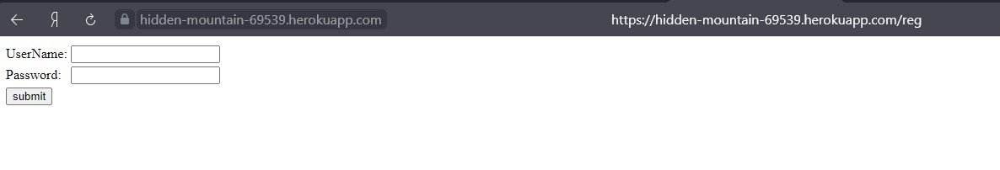
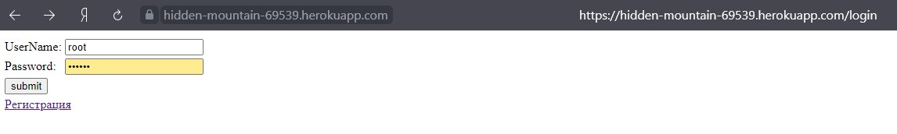
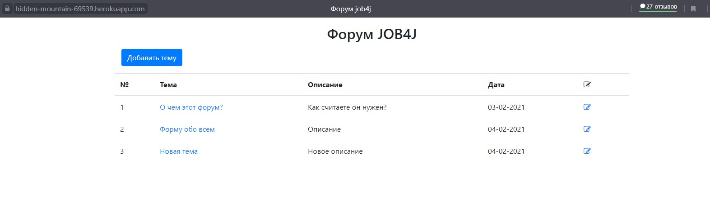

# job4j_forum

## [Классический форум.](https://hidden-mountain-69539.herokuapp.com/)

##### Использовано в проекте:

- ***Spring Boot***
- ***Spring Security***    
- ***Heroku***
- ***Maven***
- ***JUnit/Mockito***
- ***Luquibase***
- ***JaCoCo***
- ***Travis CI***
- ***JavaScript***

Проект представляет собой простой форум. Перед использованием требуется **зарегистрироваться** и **авторизоваться**
в системе. После авторизации появляется возможность создавать топики на форуме и учавствовать в обсуждениях.

- Страница регистрации на площадке.

- Страница авторизации на площадке.

- Главная страница.

